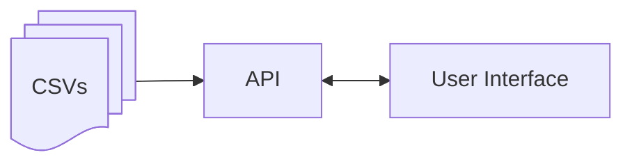

# Quorum Coding Challenge

This is a Web Application allow users to check and review information about bills and who have supported them.

## Technologies
- Back end: NodeJs using Express
- Front end: ReactJs, Vite and TypeScript

## Sytem Design notes
- Data are coming from CSV files (directory ```data```)
- No complex calculation or logic
- Simple API
- Simple Interface
- Flexible to accept new fields on the data source in the future



### API
- 2 endpoints:
    - List all legislators and the count of bills he or she supported or opposed
    - List all the bills, the count of supported and opposed votes and its primary sponsor

### Interface
- 3 pages:
    - Home Page
    - Show a table with all legislators and the count of bills he or she supported or opposed
    - Show a table with all the bills, the count of supported and opposed votes and its primary sponsor
